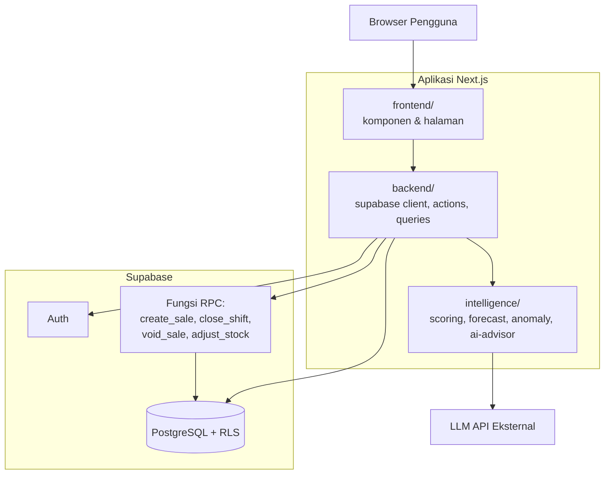
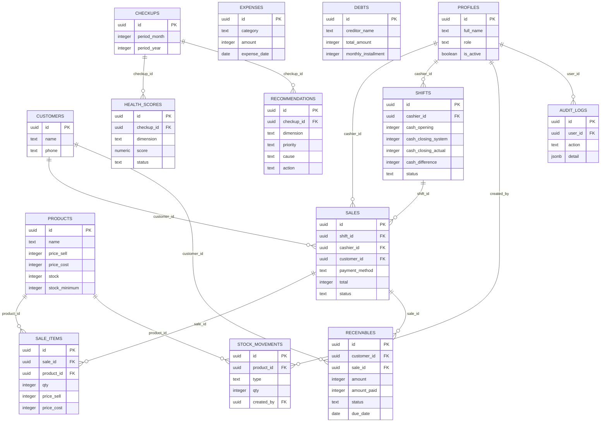
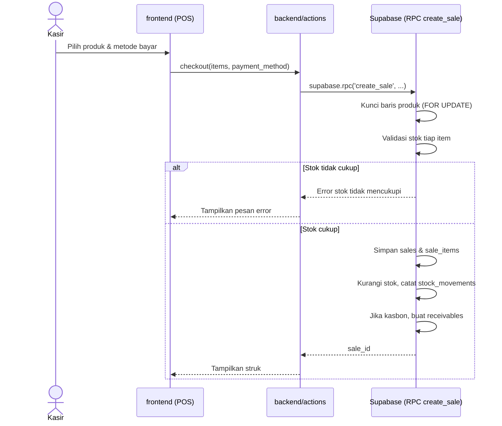
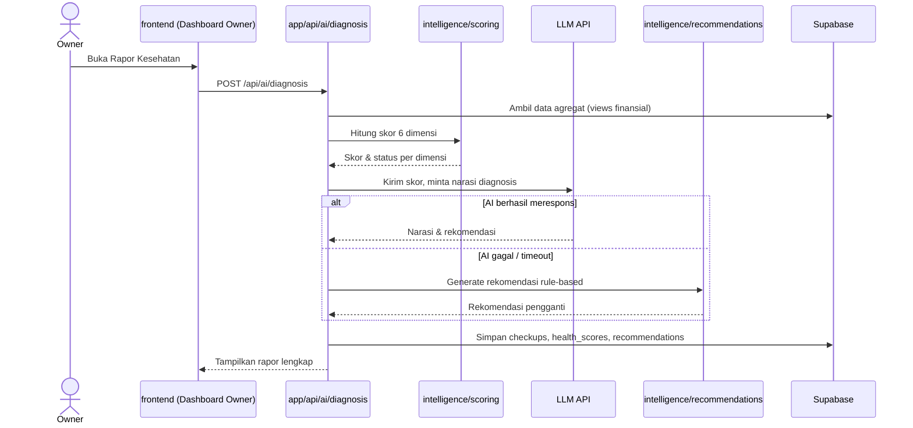

# SDD — Software Design Document: Fluxa

**Sistem Kasir dengan Diagnosis Kesehatan Bisnis Berbasis AI untuk UMKM** Kompetisi: GTNIC 2026, Kategori Web Developer Versi: 1.0 | Status: Draft — mengikuti implementasi berjalan

---

## 1. Pendahuluan

### 1.1 Tujuan

Dokumen ini menjelaskan **bagaimana** Fluxa dirancang untuk memenuhi kebutuhan yang sudah ditetapkan di SRS — arsitektur, desain data, desain komponen, algoritma kunci, dan desain keamanan. SRS menjawab "apa yang harus dilakukan sistem", dokumen ini menjawab "bagaimana sistem melakukannya".

### 1.2 Ruang Lingkup

Mencakup desain teknis lengkap: arsitektur tiga domain (frontend/backend/ intelligence), skema basis data, algoritma transaksi dan diagnosis, serta model keamanan berbasis Row Level Security (RLS).

### 1.3 Referensi

- SRS Fluxa v1 (`fluxa-srs.md`) — kebutuhan fungsional & non-fungsional
- PRD Fluxa v1 (`fluxa-prd.md`) — tujuan produk dan prioritas
- `db-schema/README.md` dan `AGENTS.md` — detail implementasi & aturan wajib
- `STRUKTUR_FOLDER.md` — pemetaan folder ke domain kerja

### 1.4 Ikhtisar Dokumen

Bagian 2 menjelaskan arsitektur sistem. Bagian 3 desain data. Bagian 4 desain komponen per domain. Bagian 5 algoritma prosedural kunci. Bagian 6 desain keamanan. Bagian 7 desain antarmuka beserta sequence diagram.

---

## 2. Desain Arsitektur

### 2.1 Gaya Arsitektur

Arsitektur tiga lapis dengan pemisahan tiga domain kerja (bukan pemisahan server fisik — semuanya berjalan dalam satu aplikasi Next.js, kecuali database yang dikelola Supabase):



### 2.2 Pemetaan Domain ke Tanggung Jawab

| Domain | Tanggung jawab | Tidak boleh dilakukan |
| --- | --- | --- |
| `frontend/` | Tampilan, interaksi pengguna, state UI | Query Supabase langsung, logika bisnis/skor |
| `backend/` | Koneksi Supabase, autentikasi, pemanggilan RPC, agregasi data untuk `intelligence/` | Logika skor/forecast/AI (didelegasikan ke `intelligence/`) |
| `intelligence/` | Perhitungan skor, rekomendasi, forecast, anomali, prompt AI | Query Supabase langsung (data masuk lewat `backend/queries/`) |

`app/` sengaja dibuat setipis mungkin — hanya routing dan komposisi, memanggil ketiga domain di atas (lihat `STRUKTUR_FOLDER.md` untuk contoh konkret `page.tsx`).

### 2.3 Keputusan Desain Kunci

| Keputusan | Alasan |
| --- | --- |
| Transaksi (`sales`, `sale_items`, `stock_movements`) hanya bisa ditulis lewat RPC, tidak lewat INSERT langsung | Menjamin stok, kas, dan piutang selalu konsisten dalam satu operasi atomik — tidak ada state "setengah tersimpan" |
| Fungsi RPC bertipe `SECURITY DEFINER` | RLS tabel transaksi sengaja ketat; fungsi inilah satu-satunya pintu resmi yang melewatinya dengan validasi manual di dalamnya |
| Uang disimpan sebagai `integer` (rupiah utuh) | Menghindari galat pembulatan dari tipe desimal/float |
| View laporan finansial memakai `security_invoker = true` | RLS tabel dasar otomatis berlaku saat view di-query, tanpa perlu RLS terpisah di level view |
| Domain `intelligence/` tidak boleh query Supabase langsung | Memungkinkan logika skor diuji secara terpisah (unit test) tanpa database sungguhan |
| Migrasi bernomor urut, tidak pernah diedit ulang | Riwayat perubahan skema tetap bisa dilacak dan direplikasi di project Supabase manapun |

---

## 3. Desain Data

### 3.1 Diagram Relasi Entitas (Lengkap)



### 3.2 Catatan Desain Data Penting

- `sale_items.price_sell` dan `price_cost` adalah **snapshot** saat transaksi terjadi, bukan diambil ulang dari `products` — supaya margin transaksi lama tetap akurat meski harga produk berubah kemudian.
- `receivables.customer_id` memakai `ON DELETE RESTRICT` secara sengaja: pelanggan yang masih punya piutang tidak bisa dihapus.
- `stock_movements.type` membedakan tiga sumber perubahan stok: `out` (penjualan), `in` (restock), `adjustment` (koreksi opname) — semuanya tercatat lewat fungsi, tidak pernah lewat UPDATE manual ke `products.stock`.

### 3.3 Strategi Migrasi

9 file migrasi diterapkan berurutan (`0001` sampai `0009`), masing-masing dengan tanggung jawab tunggal (extensions, tables, indexes, helper functions, triggers, business functions, RLS policies, views, dan fungsi tambahan). Perubahan skema di masa depan selalu berupa file baru (`0010_...sql` dst.), tidak pernah mengedit file yang sudah diterapkan — lihat `AGENTS.md` untuk aturan lengkapnya.

---

## 4. Desain Komponen

### 4.1 Domain `backend/`

| Komponen | Tanggung jawab |
| --- | --- |
| `supabase/client.ts` | Koneksi Supabase untuk Client Component |
| `supabase/server.ts` | Koneksi Supabase untuk Server Component/Action/Route Handler |
| `supabase/middleware.ts` | Refresh token sesi di tiap request |
| `auth/get-role.ts` | Baca role pengguna yang login, dipakai tiap `layout.tsx` per role |
| `actions/*.ts` | Server Actions yang memanggil RPC (checkout, buka/tutup shift, dst.) |
| `queries/*.ts` | Fungsi fetch data siap pakai (termasuk dari view finansial) untuk `intelligence/` dan `frontend/` |

### 4.2 Domain `frontend/`

| Komponen | Tanggung jawab |
| --- | --- |
| `components/pos/` | Keranjang, grid produk, modal pembayaran |
| `components/admin/` | Form produk, tabel stok, form biaya/kasbon |
| `components/owner/` | Radar chart skor, kartu rekomendasi, grafik tren |
| `components/shared/` | Navbar, badge status, empty state — lintas role |
| `hooks/` | State lokal seperti `useCart()`, `useShift()` |

### 4.3 Domain `intelligence/`

| Komponen | Tanggung jawab |
| --- | --- |
| `scoring/` | Hitung skor 6 dimensi dari data agregat (fungsi murni, dapat diuji tanpa database) |
| `recommendations/` | Engine rule-based — juga berfungsi sebagai fallback AI |
| `forecast/` | Prediksi omzet & kas 30 hari (P1) |
| `anomaly/` | Deteksi anomali kasir dari `v_cashier_shift_stats` dan `v_cashier_void_stats` (P1) |
| `ai-advisor/` | Susun prompt dari hasil `scoring/`, panggil LLM, kembalikan narasi |

---

## 5. Desain Prosedural (Algoritma Kunci)

### 5.1 `create_sale` — Transaksi Penjualan Atomik

```
MASUKAN: shift_id, customer_id (opsional), payment_method, discount, items[]
1. Validasi: pengguna harus login dan memiliki shift terbuka miliknya
2. Validasi: payment_method termasuk salah satu dari {cash, qris, transfer, credit}
3. UNTUK setiap item di items[]:
     a. Kunci baris produk (SELECT ... FOR UPDATE) untuk mencegah race condition
     b. Validasi stok mencukupi; jika tidak, batalkan SELURUH transaksi
     c. Akumulasi subtotal dari price_sell x qty
4. Hitung total = subtotal - discount (minimum 0)
5. Simpan baris sales (status: completed)
6. UNTUK setiap item di items[]:
     a. Simpan sale_items dengan snapshot price_sell & price_cost
     b. Kurangi products.stock
     c. Catat stock_movements (type: out)
7. JIKA payment_method = credit:
     Buat baris receivables (status: unpaid, jatuh tempo +14 hari)
8. Catat audit_logs
9. KELUARAN: sale_id
```

Langkah 3a (penguncian baris) adalah mitigasi khusus untuk NFR-06 (dua transaksi bersamaan terhadap produk yang sama) — **sudah diuji**.

### 5.2 `close_shift` — Rekonsiliasi Kas

```
MASUKAN: shift_id, cash_actual (kas fisik hasil hitung manual)
1. Validasi shift milik kasir yang login dan masih berstatus open
2. Hitung cash_sales = SUM(total) dari sales dengan payment_method=cash
   dan status=completed pada shift tersebut
3. cash_system = cash_opening + cash_sales
4. cash_difference = cash_actual - cash_system
5. Update shift: closed_at=now(), status=closed, simpan ketiga nilai di atas
6. Catat audit_logs
```

### 5.3 `void_sale` — Pembatalan Transaksi

```
MASUKAN: sale_id, reason
1. Validasi aktor adalah admin/owner (is_admin_or_owner()); jika bukan, tolak
2. Validasi status transaksi belum void
3. UNTUK setiap item di sale_items milik sale_id:
     a. Kembalikan qty ke products.stock
     b. Catat stock_movements (type: in, catatan: "Void transaksi ...")
4. Update sales: status=void, voided_by, void_reason
5. JIKA ada receivables terkait dan belum lunas: tandai status=void
6. Catat audit_logs
```

### 5.4 `adjust_stock` — Stok Masuk & Koreksi Opname

```
MASUKAN: product_id, type ('in' | 'adjustment'), qty, note
1. Validasi aktor adalah admin/owner
2. Kunci baris produk (FOR UPDATE)
3. JIKA type = 'in':
     Validasi qty > 0
     products.stock += qty
     Catat stock_movements (type: in)
   SEBALIKNYA (type = 'adjustment', qty = stok akhir hasil hitung fisik):
     Validasi qty >= 0
     diff = qty - stok_saat_ini
     JIKA diff = 0: selesai tanpa mencatat apa pun (tidak ada perubahan nyata)
     products.stock = qty (angka absolut, bukan penambahan)
     Catat stock_movements (type: adjustment, qty: |diff|, catatan berisi
     nilai sebelum & sesudah)
4. Catat audit_logs
```

### 5.5 Perhitungan Skor Kesehatan Bisnis (Desain, Implementasi Menyusul)

```
MASUKAN: data agregat bulan berjalan dari backend/queries/financials.ts
         (revenue, cogs, expenses, receivables, cash position, stock value)

UNTUK setiap dari 6 dimensi (profitabilitas, cash_flow, efisiensi_biaya,
utang, pertumbuhan, perputaran_stok_piutang):
  1. Hitung rasio keuangan relevan dimensi tersebut
     (mis. profitabilitas -> margin kotor & bersih)
  2. Petakan rasio ke skor 0-100 berdasarkan ambang batas
  3. Tentukan status: sehat (>=70) / perhatian (40-69) / kritis (<40)
     -- ambang batas 70/40 adalah DEFAULT SEMENTARA, bukan hasil riset final

KELUARAN: skor per dimensi + skor gabungan, disimpan ke health_scores
```

> **Catatan status:** ambang batas rasio per dimensi **belum final** — ini adalah tugas riset yang tercatat di Tracker ("Riset ambang batas rasio keuangan UMKM, catat sumbernya"). Dokumen ini sengaja tidak mengarang angka pasti sebelum riset tersebut selesai, supaya proposal tidak memuat klaim yang tidak bisa dipertanggungjawabkan sumbernya.

### 5.6 Fallback AI → Rule-Based

```
1. Panggil scoring/ untuk mendapat skor 6 dimensi
2. COBA panggil ai-advisor/ dengan skor sebagai konteks, batas waktu tertentu
3. JIKA berhasil dalam batas waktu: gunakan narasi & rekomendasi dari AI
4. JIKA gagal/timeout/error: panggil recommendations/ (rule-based) sebagai
   pengganti -- pengguna TIDAK PERNAH melihat halaman kosong atau pesan
   error teknis
5. Simpan hasil (apa pun sumbernya) ke recommendations dengan kolom
   source='ai' atau source='rule_based' agar bisa dibedakan nanti
```

---

## 6. Desain Keamanan

### 6.1 Model Row Level Security

Hak akses dipaksa di level database (RLS), bukan hanya disembunyikan di antarmuka. Tiga fungsi bantu (`current_role()`, `is_admin_or_owner()`, `is_owner()`) dipakai di seluruh kebijakan RLS. Fungsi-fungsi ini bertipe `SECURITY DEFINER` untuk menghindari *infinite recursion* saat memeriksa tabel `profiles` dari dalam kebijakan RLS tabel `profiles` itu sendiri.

### 6.2 Pola SECURITY DEFINER untuk Fungsi Transaksi

Tabel `sales`, `sale_items`, dan `stock_movements` **tidak memiliki** kebijakan INSERT/UPDATE langsung untuk client — satu-satunya jalur adalah lewat fungsi RPC (`create_sale`, `close_shift`, `void_sale`, `adjust_stock`) yang bertipe `SECURITY DEFINER` sehingga bisa menulis meski RLS tabel dasarnya ketat. Validasi otorisasi dilakukan **manual di dalam fungsi** (misalnya `void_sale` memeriksa `is_admin_or_owner()` sebelum mengizinkan pembatalan).

### 6.3 Pencegahan Eskalasi Hak Akses

Trigger `trg_guard_profile_role_change` menolak percobaan pengguna mengubah kolom `role` atau `is_active` miliknya sendiri lewat UPDATE biasa, terlepas dari kebijakan RLS yang mengizinkan update ke baris sendiri (untuk kolom lain seperti nama). Ini lapisan keamanan kedua di luar RLS.

### 6.4 Manajemen Kunci Rahasia

| Kunci | Lokasi penggunaan | Boleh di browser? |
| --- | --- | --- |
| `NEXT_PUBLIC_SUPABASE_ANON_KEY` | Semua client | Ya |
| `SUPABASE_SERVICE_ROLE_KEY` | Route Handler AI, skrip seed | **Tidak** |
| API key LLM | `intelligence/ai-advisor/` (dipanggil server-side) | **Tidak** |

---

## 7. Desain Antarmuka

### 7.1 Peta Halaman per Role

| Route group | Role yang bisa akses | Contoh halaman |
| --- | --- | --- |
| `(auth)` | Semua (belum login) | `/login` |
| `(kasir)` | Kasir, Admin, Owner | `/pos`, `/shift` |
| `(admin)` | Admin, Owner | `/produk`, `/stok`, `/biaya`, `/kasbon`, `/akun` |
| `(owner)` | Owner | `/rapor`, `/laporan`, `/audit` |

Proteksi dilakukan di `layout.tsx` tiap route group (server-side, memanggil `getCurrentUserRole()`), bukan di middleware — supaya middleware tetap ringan dan tidak query database di tiap request.

### 7.2 Sequence Diagram: Checkout



### 7.3 Sequence Diagram: Diagnosis Kesehatan Bisnis dengan Fallback



---

## 8. Lampiran

- Kode lengkap tiap fungsi RPC (termasuk penanganan error lengkap): `db-schema/supabase/migrations/0006_business_functions.sql` dan `0009_adjust_stock.sql`
- Kebijakan RLS lengkap per tabel: `0007_rls_policies.sql`
- Struktur folder & starter kit kerja (auth, middleware, routing per role): starter kit yang sudah di-scaffold sebelumnya
- SRS Fluxa v1 untuk daftar kebutuhan yang dijadikan acuan desain ini

Dokumen ini akan diperbarui setelah ambang batas skor kesehatan bisnis (Bagian 5.5) final dari hasil riset, dan setelah komponen UI/intelligence selesai diimplementasikan.