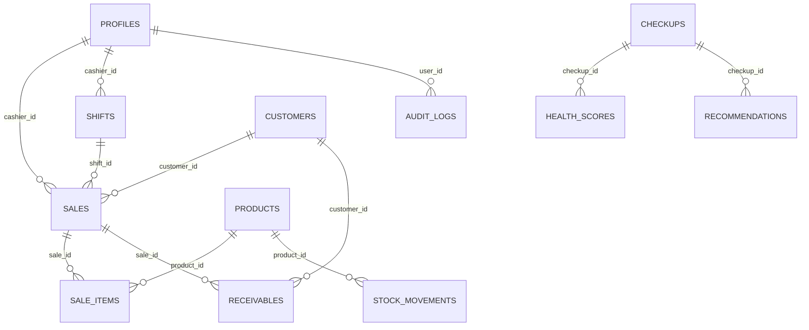
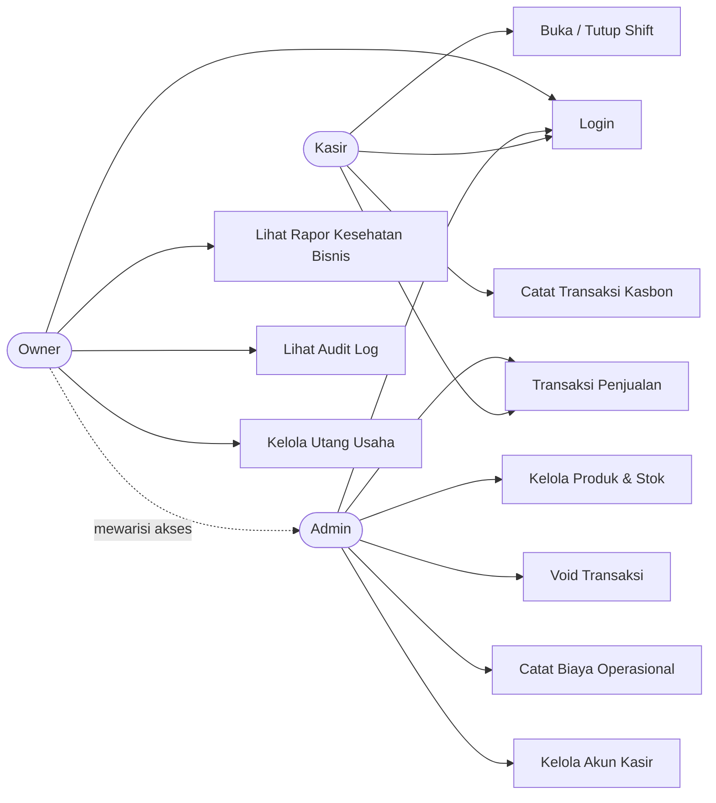

# SRS — Software Requirements Specification: Fluxa

**Sistem Kasir dengan Diagnosis Kesehatan Bisnis Berbasis AI untuk UMKM** Kompetisi: GTNIC 2026, Kategori Web Developer Versi: 1.0 | Status: Draft

---

## 1. Pendahuluan

### 1.1 Tujuan Dokumen

Dokumen ini menjabarkan kebutuhan perangkat lunak Fluxa secara rinci dan tertelusur, sebagai acuan teknis bagi tim pengembang (backend, frontend, intelligence) selama proses pembangunan sistem, dan sebagai referensi saat menyusun proposal kompetisi GTNIC 2026.

### 1.2 Ruang Lingkup Produk

Fluxa adalah aplikasi web yang menggabungkan dua fungsi: **sistem kasir (Point of Sale)** untuk mencatat transaksi harian UMKM, dan **modul diagnosis kesehatan bisnis** yang mengolah data transaksi tersebut menjadi skor kesehatan finansial beserta rekomendasi tindakan, dibantu kecerdasan buatan (AI) dengan mekanisme cadangan (fallback) berbasis aturan (rule-based). Sistem melayani tiga peran pengguna: kasir, admin, dan owner (pemilik usaha).

### 1.3 Definisi, Akronim, dan Singkatan

| Istilah | Keterangan |
| --- | --- |
| POS | Point of Sale — sistem kasir |
| UMKM | Usaha Mikro, Kecil, dan Menengah |
| RLS | Row Level Security — pembatasan akses data di level baris database |
| RPC | Remote Procedure Call — fungsi database yang dipanggil dari aplikasi |
| Kasbon / Piutang | Transaksi yang belum dibayar tunai, dicatat sebagai utang pelanggan |
| Opname | Penghitungan stok fisik untuk mengoreksi catatan sistem |
| Rapor Kesehatan Bisnis | Laporan skor kondisi finansial usaha per periode |
| FR | Functional Requirement — kebutuhan fungsional |
| NFR | Non-Functional Requirement — kebutuhan non-fungsional |

### 1.4 Referensi

- Guidebook GTNIC 2026, Kategori Web Developer
- PRD Fluxa v1 (`fluxa-prd.md`)
- `AGENTS.md`, `README.md`, dan skrip migrasi di folder `db-schema/`
- `STRUKTUR_FOLDER.md`

### 1.5 Ikhtisar Dokumen

Bagian 2 menjelaskan gambaran umum produk. Bagian 3 merinci kebutuhan fungsional dan non-fungsional. Bagian 4 berisi diagram dan spesifikasi use case. Bagian 5 adalah matriks ketertelusuran ke PRD.

---

## 2. Deskripsi Umum

### 2.1 Perspektif Produk

Fluxa adalah produk baru yang berdiri sendiri (bukan pengembangan dari sistem yang sudah ada), berbasis web dengan arsitektur tiga lapis:

1. **Lapisan antarmuka** — Next.js (App Router), diakses lewat browser
2. **Lapisan data & logika transaksi** — Supabase (PostgreSQL, Auth, Row Level Security, fungsi RPC)
3. **Lapisan kecerdasan** — pemanggilan model AI eksternal dari server, dengan logika rule-based sebagai cadangan

### 2.2 Fungsi Utama Produk

- Transaksi penjualan (kasir) dengan dukungan banyak metode pembayaran
- Manajemen produk, stok, dan kartu stok
- Manajemen shift kasir dengan rekonsiliasi kas otomatis
- Pencatatan biaya operasional, piutang (kasbon), dan utang usaha
- Perhitungan skor kesehatan bisnis otomatis dari data transaksi
- Rekomendasi tindakan berbasis AI dan rule-based
- Dashboard dan audit log untuk owner

### 2.3 Karakteristik Pengguna

| Peran | Tingkat literasi teknis | Kebutuhan utama |
| --- | --- | --- |
| Kasir | Rendah-menengah, mengoperasikan aplikasi sehari-hari | Antarmuka cepat, minim langkah, minim risiko salah klik |
| Admin | Menengah, mengelola operasional toko | Kontrol data produk/stok/biaya yang jelas dan mudah dikoreksi |
| Owner | Beragam, kemungkinan tidak punya latar belakang akuntansi | Insight dalam bahasa awam, bukan istilah keuangan teknis |

### 2.4 Batasan (Constraints)

- Teknologi wajib: Next.js dan Supabase (keputusan tim, lihat PRD bagian Arsitektur Teknis)
- Harus di-hosting live dan dapat diakses publik sampai periode penjurian berakhir (syarat panitia GTNIC 2026)
- Tidak menggunakan payment gateway, printer, atau barcode scanner sungguhan — lihat Non-Goals di PRD
- Pengembangan dibatasi waktu ±6 minggu (deadline submission 10 November 2026), sehingga prioritas kebutuhan mengikuti klasifikasi P0/P1/P2 di Bagian 3.1

### 2.5 Asumsi dan Ketergantungan

- Pengguna memiliki koneksi internet aktif saat mengoperasikan sistem (tidak ada mode offline)
- Layanan tier gratis Supabase dan Vercel tersedia dan stabil selama periode pengembangan hingga penjurian
- Layanan AI pihak ketiga (LLM) tersedia; jika gagal, sistem **wajib** tetap berfungsi lewat jalur cadangan rule-based (lihat FR-19)
- Browser pengguna adalah browser modern (Chrome, Firefox, Safari, Edge)

---

## 3. Kebutuhan Spesifik

### 3.1 Kebutuhan Fungsional

Prioritas: **P0** = wajib ada, **P1** = diinginkan, **P2** = pengembangan lanjutan. Kolom Status menandai kebutuhan yang logika backend-nya **sudah diuji end-to-end** per penyusunan dokumen ini.

#### Modul: Autentikasi & Otorisasi

| ID | Deskripsi | Aktor | Prioritas | Status |
| --- | --- | --- | --- | --- |
| FR-01 | Sistem menyediakan login dengan email dan kata sandi | Semua | P0 | Terimplementasi |
| FR-02 | Sistem membatasi akses data berdasarkan role di level database (RLS), bukan hanya di antarmuka | Semua | P0 | **Diuji & lulus** |
| FR-03 | Sistem mencegah pengguna mengubah role atau status akunnya sendiri | Semua | P0 | **Diuji & lulus** |

#### Modul: Transaksi Penjualan (POS)

| ID | Deskripsi | Aktor | Prioritas | Status |
| --- | --- | --- | --- | --- |
| FR-04 | Sistem menampilkan dan memungkinkan pencarian produk aktif untuk ditambahkan ke keranjang | Kasir, Admin, Owner | P0 | Belum (UI) |
| FR-05 | Sistem memproses transaksi penjualan secara atomik: validasi stok, pengurangan stok, penyimpanan snapshot harga, dan pencatatan kartu stok dalam satu operasi database | Kasir, Admin, Owner | P0 | **Diuji & lulus** |
| FR-06 | Sistem mendukung 4 metode pembayaran: tunai, QRIS (simulasi), transfer, dan kasbon | Kasir, Admin, Owner | P0 | **Diuji & lulus** |
| FR-07 | Sistem membentuk catatan piutang otomatis saat metode bayar kasbon dipilih | Kasir, Admin, Owner | P0 | **Diuji & lulus** |
| FR-08 | Sistem memungkinkan pembatalan (void) transaksi oleh admin/owner, dengan stok dikembalikan otomatis | Admin, Owner | P0 | **Diuji & lulus** |
| FR-09 | Sistem menolak percobaan void oleh kasir | Kasir | P0 | **Diuji & lulus** |

#### Modul: Manajemen Shift Kasir

| ID | Deskripsi | Aktor | Prioritas | Status |
| --- | --- | --- | --- | --- |
| FR-10 | Sistem memungkinkan kasir membuka shift dengan mencatat kas awal | Kasir | P0 | **Diuji & lulus** |
| FR-11 | Sistem menghitung kas sistem otomatis saat shift ditutup (kas awal + total penjualan tunai) dan membandingkannya dengan kas fisik yang diinput | Kasir | P0 | **Diuji & lulus** |

#### Modul: Manajemen Produk & Stok

| ID | Deskripsi | Aktor | Prioritas | Status |
| --- | --- | --- | --- | --- |
| FR-12 | Sistem menyediakan CRUD produk (nama, kategori, harga jual, harga modal, stok minimum) | Admin, Owner | P0 | Belum (UI) |
| FR-13 | Sistem mencatat stok masuk (restock) dan mengoreksi stok (opname) melalui fungsi terpisah yang otomatis mencatat kartu stok | Admin, Owner | P0 | **Diuji & lulus** |
| FR-14 | Sistem menolak percobaan kasir mengubah stok secara langsung | Kasir | P0 | **Diuji & lulus** |

#### Modul: Manajemen Keuangan

| ID | Deskripsi | Aktor | Prioritas | Status |
| --- | --- | --- | --- | --- |
| FR-15 | Sistem memungkinkan pencatatan biaya operasional per kategori dan tanggal | Admin, Owner | P0 | Belum (UI) |
| FR-16 | Sistem melacak piutang pelanggan beserta status (belum lunas/sebagian/lunas/void) dan tanggal jatuh tempo | Admin, Owner | P0 | Belum (UI) |
| FR-17 | Sistem memungkinkan pencatatan utang usaha dan cicilan bulanan | Owner | P1 | Belum (UI) |

#### Modul: Diagnosis Kesehatan Bisnis

| ID | Deskripsi | Aktor | Prioritas | Status |
| --- | --- | --- | --- | --- |
| FR-18 | Sistem menghitung skor kesehatan bisnis pada 6 dimensi (profitabilitas, cash flow, efisiensi biaya, utang, pertumbuhan, perputaran stok/piutang) dari data transaksi, tanpa input manual ulang | Owner | P0 | Belum (logika) |
| FR-19 | Sistem menghasilkan rekomendasi berbasis aturan (rule-based) untuk tiap dimensi bernilai rendah, mencakup penyebab dan saran tindakan spesifik | Owner | P0 | Belum (logika) |
| FR-20 | Sistem menghasilkan diagnosis berbasis AI; jika layanan AI gagal/timeout, sistem **wajib** menampilkan hasil rule-based sebagai cadangan, bukan kosong/error | Owner | P0 | Belum (logika) |
| FR-21 | Sistem menyimpan riwayat skor per periode (bulanan) untuk ditampilkan sebagai tren | Owner | P0 | Belum (logika) |
| FR-22 | Sistem memprediksi omzet dan posisi kas 30 hari ke depan | Owner | P1 | Belum |
| FR-23 | Sistem mendeteksi anomali kasir (selisih kas atau frekuensi void tidak wajar) | Owner | P1 | Belum |

#### Modul: Dashboard & Pelaporan

| ID | Deskripsi | Aktor | Prioritas | Status |
| --- | --- | --- | --- | --- |
| FR-24 | Sistem menampilkan dashboard owner berupa radar chart skor per dimensi dan grafik tren bulanan | Owner | P0 | Belum (UI) |
| FR-25 | Sistem mencatat audit log atas aksi penting (transaksi, void, perubahan stok, perubahan role) dan menampilkannya hanya kepada owner | Owner | P1 | **Diuji & lulus** (pencatatan); tampilan belum |
| FR-26 | Sistem menyediakan ekspor rapor kesehatan ke format PDF | Owner | P1 | Belum |
| FR-27 | Sistem menyediakan fitur tanya-jawab berbasis data ("Tanya Bisnis") | Owner | P2 | Belum |

### 3.2 Kebutuhan Non-Fungsional

| ID | Kategori | Deskripsi |
| --- | --- | --- |
| NFR-01 | Keamanan | Hak akses dipaksa di level database (RLS), bukan hanya disembunyikan di antarmuka — **diuji** dengan percobaan akses lintas role |
| NFR-02 | Keamanan | Kunci rahasia (`service_role key`, API key AI) hanya berada di lingkungan server, tidak pernah terekspos ke browser |
| NFR-03 | Keamanan | Perubahan role/status akun hanya bisa dilakukan admin/owner, dicegah lewat trigger database — **diuji** |
| NFR-04 | Keandalan | Transaksi penjualan bersifat atomik — tidak ada kondisi data "setengah tersimpan" meskipun terjadi kegagalan di tengah proses — **diuji** |
| NFR-05 | Keandalan | Modul diagnosis AI wajib memiliki jalur cadangan (fallback) yang berfungsi penuh tanpa AI |
| NFR-06 | Kinerja | Pengambilan baris produk dikunci (row lock) saat transaksi untuk mencegah kondisi stok minus akibat dua transaksi bersamaan — **diuji** |
| NFR-07 | Kegunaan | Antarmuka responsif di desktop, tablet, dan smartphone |
| NFR-08 | Kegunaan | Seluruh antarmuka berbahasa Indonesia, istilah keuangan di rapor kesehatan ditulis dalam bahasa awam, bukan istilah akuntansi teknis |
| NFR-09 | Portabilitas | Berfungsi baik di browser utama: Chrome, Firefox, Safari, Edge (syarat panitia) |
| NFR-10 | Ketersediaan | Aplikasi dan database tetap aktif (tidak idle/pause) sejak submission hingga periode penjurian berakhir |
| NFR-11 | Maintainability | Perubahan skema database dilakukan lewat file migrasi bernomor urut, tidak pernah mengubah file migrasi lama yang sudah diterapkan |
| NFR-12 | Maintainability | Kode dipisah ke tiga domain (frontend/backend/intelligence) agar perubahan satu domain meminimalkan dampak ke domain lain |

### 3.3 Kebutuhan Antarmuka Eksternal

| Jenis Antarmuka | Deskripsi |
| --- | --- |
| Antarmuka pengguna | Web responsif, navigasi berbeda per role setelah login |
| Antarmuka perangkat keras | Tidak ada — sistem tidak bergantung pada printer/scanner fisik (lihat Non-Goals PRD) |
| Antarmuka perangkat lunak | Supabase (PostgreSQL + Auth API via `@supabase/ssr`), API LLM pihak ketiga (dipanggil server-side) |
| Antarmuka komunikasi | HTTPS untuk seluruh komunikasi klien-server; akses database lewat Supabase client library (PostgREST di baliknya) |

### 3.4 Kebutuhan Basis Data

Skema terdiri dari 14 tabel inti. Diagram relasi (disederhanakan, hanya relasi kunci) dan daftar tabel sebagai berikut:

| Tabel | Fungsi |
| --- | --- |
| `profiles` | Identitas & role pengguna |
| `products` | Katalog produk, harga jual & modal, stok |
| `stock_movements` | Kartu stok (masuk/keluar/koreksi) |
| `customers` | Data pelanggan |
| `shifts` | Sesi kerja kasir & rekonsiliasi kas |
| `sales`, `sale_items` | Transaksi penjualan & rincian item |
| `receivables` | Piutang/kasbon pelanggan |
| `expenses` | Biaya operasional |
| `debts` | Utang usaha |
| `checkups`, `health_scores`, `recommendations` | Rapor kesehatan bisnis per periode |
| `audit_logs` | Jejak audit aksi penting |

Skema lengkap beserta tipe data, constraint, dan kebijakan RLS ada di `db-schema/supabase/migrations/`.

---

## 4. Use Case

### 4.1 Diagram Use Case

> Catatan: Mermaid tidak punya notasi UML use-case asli, jadi diagram ini digambar sebagai flowchart yang merepresentasikan hubungan aktor dan use case, bukan notasi UML baku.

### 4.2 Spesifikasi Use Case Kritis

**UC-2: Transaksi Penjualan**

- **Aktor:** Kasir (juga Admin, Owner)
- **Prakondisi:** Kasir sudah login dan memiliki shift berstatus terbuka
- **Alur utama:**
  1. Kasir mencari dan memilih produk ke keranjang
  2. Kasir memilih metode pembayaran
  3. Sistem memvalidasi ketersediaan stok tiap item
  4. Sistem menyimpan transaksi, mengurangi stok, mencatat kartu stok
  5. Jika metode kasbon, sistem membentuk catatan piutang
  6. Sistem menampilkan struk
- **Alur alternatif:** Jika stok tidak cukup pada langkah 3, sistem menampilkan pesan kesalahan dan transaksi dibatalkan seluruhnya (tidak ada item yang terpotong sebagian)
- **Pascakondisi:** Stok berkurang sesuai item terjual, transaksi tercatat sebagai `completed`

**UC-6: Void Transaksi**

- **Aktor:** Admin, Owner
- **Prakondisi:** Transaksi berstatus `completed` (belum pernah di-void)
- **Alur utama:**
  1. Admin/owner memilih transaksi yang akan dibatalkan dan mengisi alasan
  2. Sistem memverifikasi aktor memiliki role admin/owner
  3. Sistem mengembalikan stok tiap item ke `products`
  4. Sistem menandai transaksi berstatus `void`
  5. Jika transaksi terkait piutang, piutang ditandai `void`
- **Alur alternatif:** Jika aktor berrole kasir, sistem menolak dengan pesan kesalahan sebelum langkah 3 dijalankan
- **Pascakondisi:** Stok kembali seperti sebelum transaksi, status transaksi dan piutang terkait konsisten

**UC-9: Lihat Rapor Kesehatan Bisnis**

- **Aktor:** Owner
- **Prakondisi:** Owner sudah login; minimal ada satu periode checkup tersedia
- **Alur utama:**
  1. Sistem mengambil data agregat finansial periode berjalan
  2. Sistem menghitung skor 6 dimensi
  3. Sistem memanggil layanan AI untuk menyusun narasi diagnosis
  4. Sistem menampilkan skor, narasi, dan rekomendasi tindakan
- **Alur alternatif:** Jika layanan AI gagal pada langkah 3, sistem menampilkan rekomendasi rule-based sebagai pengganti, tanpa menampilkan halaman kosong atau pesan error ke pengguna
- **Pascakondisi:** Rapor tersimpan untuk periode tersebut dan dapat ditampilkan kembali dari riwayat

---

## 5. Matriks Ketertelusuran (ke PRD)

| FR/NFR | Goal PRD Terkait |
| --- | --- |
| FR-05, FR-06, FR-07 | Goal 1 — Satu sumber data |
| FR-18, FR-19, FR-20, FR-21 | Goal 2 — Diagnosis dalam \<2 menit |
| FR-04, FR-05, FR-10, FR-11 | Goal 3 — Transaksi kasir cepat & akurat |
| NFR-01, NFR-02, NFR-03, NFR-10 | Goal 4 — Sistem live dan berfungsi penuh saat penjurian |
| FR-18–FR-27, NFR-05 | Goal 5 — Keunikan dibanding submission POS UMKM lain |

Requirement yang berstatus **P2** (FR-27) dan sebagian **P1** (FR-17, FR-22, FR-23, FR-26) secara sengaja tidak dipetakan sebagai penentu utama goal manapun — ini konsisten dengan Non-Goals di PRD, dan jadi kandidat pertama yang dipangkas kalau waktu pengembangan tidak mencukupi.

---

## 6. Lampiran

- Skema database lengkap & kebijakan RLS: `db-schema/supabase/migrations/`
- Aturan wajib untuk pengembangan (termasuk AI agent): `AGENTS.md`
- Struktur folder & pembagian domain kerja: `STRUKTUR_FOLDER.md`
- Konteks produk, goals, dan status implementasi terkini: `fluxa-prd.md`

Dokumen ini akan diperbarui begitu modul UI dan intelligence selesai diimplementasikan — kolom Status di Bagian 3.1 adalah sumber kebenaran progres paling akurat per saat ini.